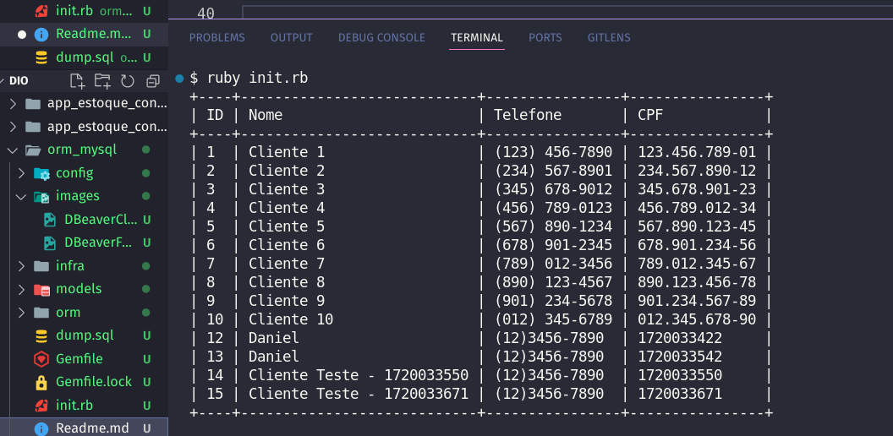
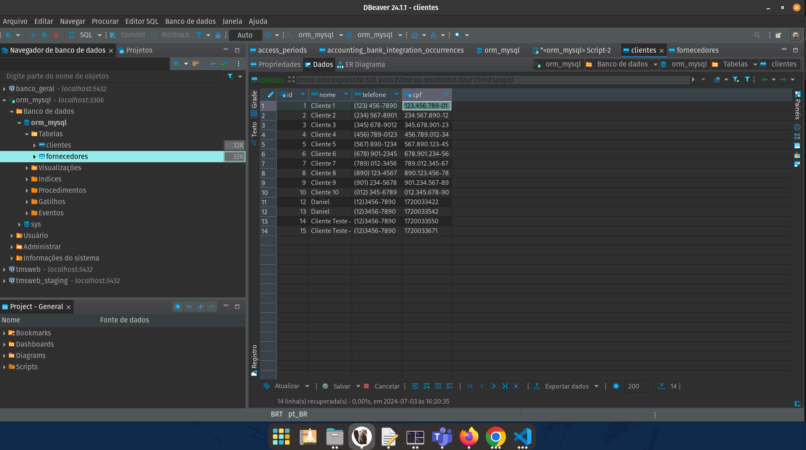
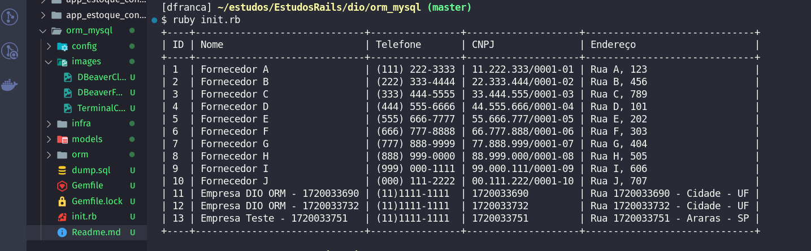

# Desafio DIO Criando um Cadastro de Clientes com Ruby e MySql

## Desafio

O desafio consistia em reproduzir um ORM em RUBY que apresenta-se o uma tabela de Cliente e outra de Fornecedores.

Já existindo um pre cadastro no banco de dados MySql deveriamos mostrar esses dados já pré cadastrados e incluir novos dados:

## Execução

Acompanhei a aula do instrutor Danilo replicando o código em minha máquina, porem não instalei diretamente o Banco MySql,
fiz o uso do docker para baixar uma imagem do MySql e rodei o mesmo em um contairner.

Abaixo uma amostra de como ficou as tabelas após a finalização:

### Tabela Clientes:

### Tabela Fornecedores:

